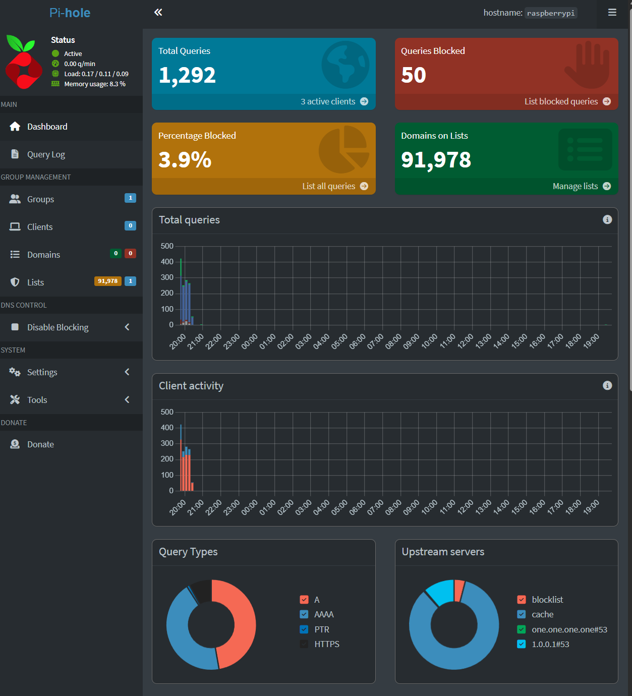
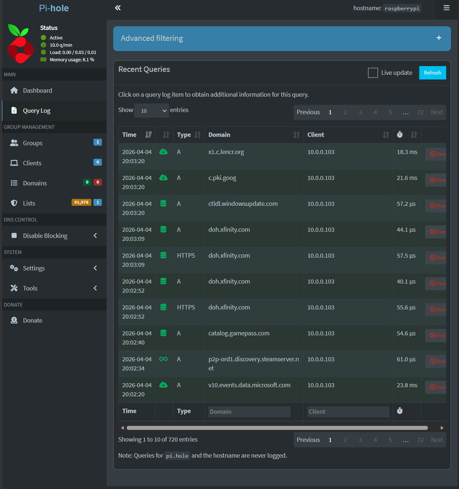
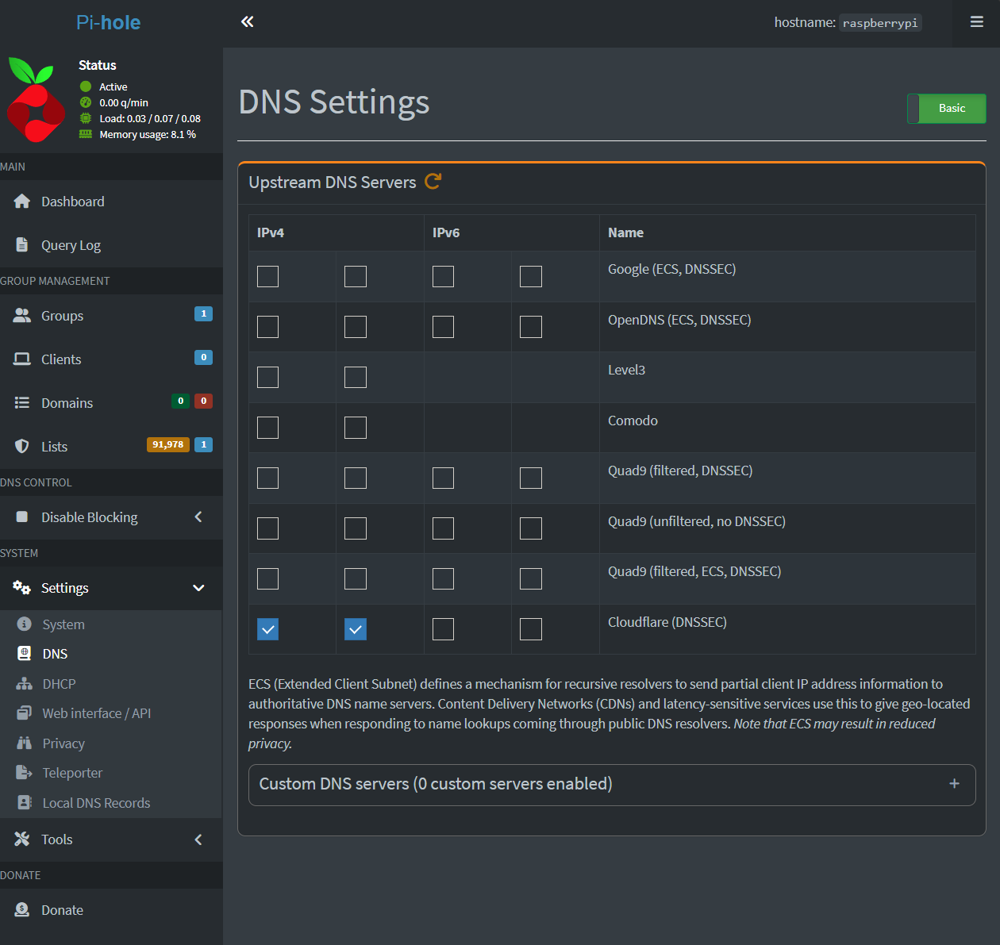
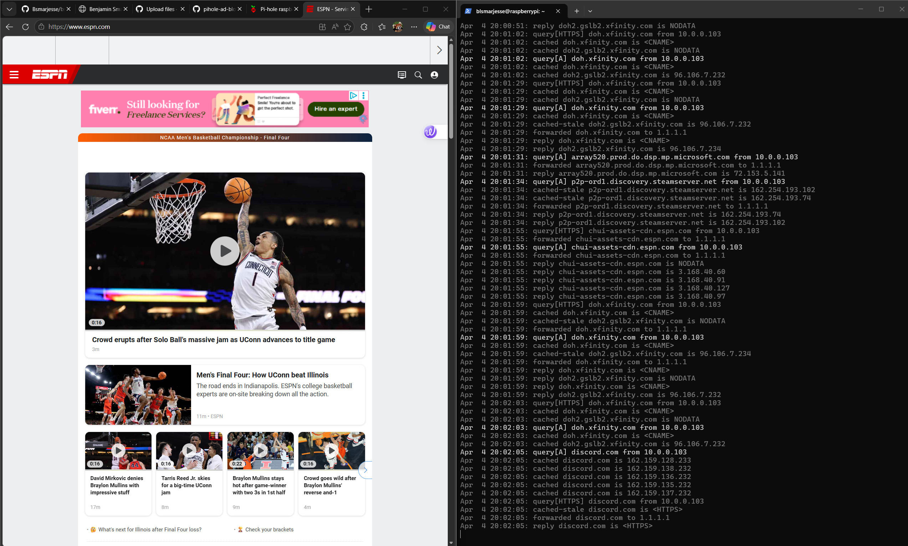
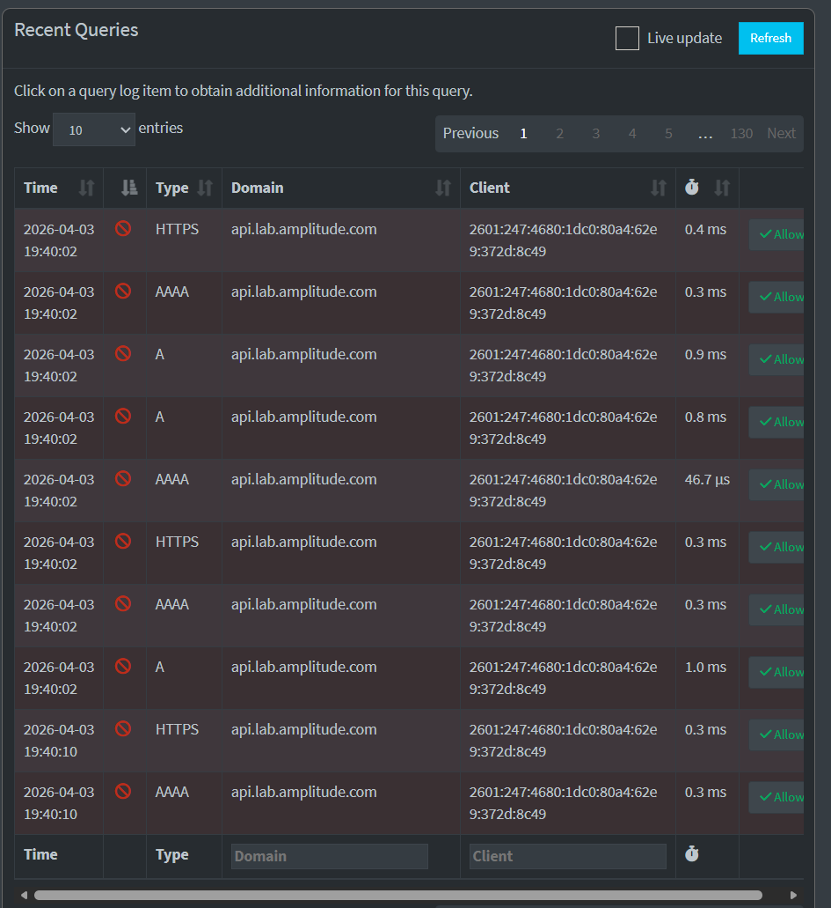

# pihole-ad-blocking-lab
Network-wide ad blocking solution using Pi-hole with DNS filtering, IPv6 mitigation, and home lab integration.

# Pi-hole Ad Blocking Lab

Network-wide ad blocking solution using Pi-hole with DNS filtering, IPv6 mitigation, and home lab integration.

---

## Overview

This project demonstrates the deployment and configuration of Pi-hole as a DNS-based ad-blocking solution in a home lab environment. It includes DNS configuration, client integration, and troubleshooting of IPv6 bypass issues.

---

## Key Skills Demonstrated

- DNS configuration and troubleshooting  
- Network-wide ad blocking using Pi-hole  
- IPv6 bypass mitigation in ISP environments  
- Remote system administration via SSH  
- Real-time DNS traffic monitoring and validation  

---

## Environment

- Raspberry Pi (Pi-hole host)
- Windows client device
- Xfinity ISP router
- Pi-hole installed via official script

---

## Screenshots

### Dashboard

### Query Log (Client Traffic)

### DNS Settings

---

## Live DNS Query Monitoring

Validated DNS traffic using real-time logging:

---

## Remote Management via SSH

Managed the Raspberry Pi remotely using SSH:

---

## Ad Blocking Validation

Blocked known ad and tracking domains and verified filtering:

---

## Real-World Challenge

Xfinity router enforced IPv6 DNS, which bypassed Pi-hole filtering.

### Resolution:
Disabled IPv6 on the client device to ensure DNS queries were routed through Pi-hole.

---

## Security Considerations

Sensitive information such as usernames has been sanitized. Internal IP addresses are part of a private lab environment.
